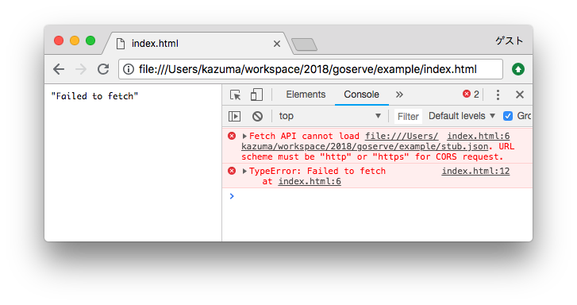
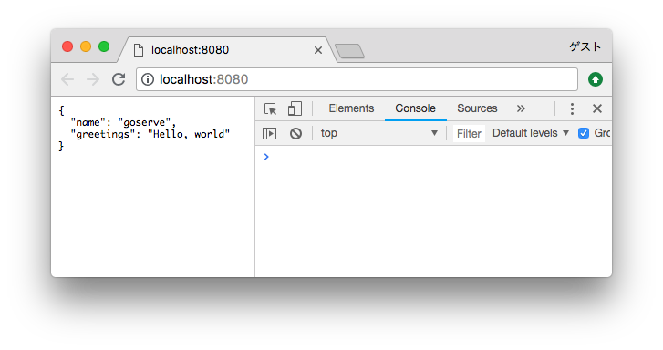

# goserve

**goserve** is a distributable HTTP server for your HTMLs.

It is just a small single file with no configuration but gives your HTMLs the power of `http:` protocol instead of `file:` protocol.


## Basic usage

Place a [**goserve** binary](bin/) into your directory and run to show your HTMLs under the directory.

BEFORE (without **goserve**):

```diff
 example/
 ├── index.html
 └── message.json
```

Run `open index.html` (or just double click to open `index.html`), you will see:



AFTER (with **goserve** for macOS):

```diff
 example/
+├── goserve-mac
 ├── index.html
 └── message.json
```

Run `./goserve-mac` (or just double click to start `goserve.exe` when you use Windows), you will see:




## Config

### Routing (mapping between a URL and a file path)

Add `goserve.json` in the directory where **goserve** exists.

```diff
 example/
+├── goserve.json
 ├── goserve-mac
 ├── index.html
 └── message.json
```

```json
{
  "routes": {
    "/api/(.*)": "$1.json"
  }
}
```

You can see the content of `message.json` at `http://localhost:8080/api/message` in addition to `http://localhost:8080/message.json`.


### Change port

```diff
 {
+  "port": 8000,
   "routes": {
     "/api/(.*)": "$1.json"
   }
 }
```


# Development

## Requirements

To build **goserve** from the source, you need:

- [The Go Programming Language](https://golang.org/)
- [Make - GNU Project - Free Software Foundation](https://www.gnu.org/software/make/)
- [UPX: the Ultimate Packer for eXecutables - Homepage](https://upx.github.io/)
